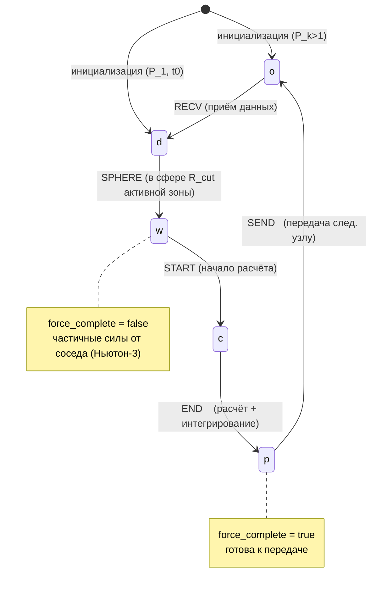

# СПЕЦИФИКАЦИЯ КОНЕЧНОГО АВТОМАТА РАСЧЁТНЫХ ЗОН (TimeConveyor FSM)
## Формальный вход для разработки в Claude Code · v1.0 · 2026-06-05 · ревизия 2026-06-11

**Назначение.** Этот документ — точная, реализуемая спецификация ядра метода декомпозиции времени (TD): динамической смены типов расчётных зон в кольцевом конвейере. Это самая новая и сложная часть движка; именно её ошибочная реализация ломает причинность. Документ предназначен для прямого использования агентом при разработке класса `TimeConveyor` (Спринт 3 ТЗ).

**Источник истины.** Диссертация Андреева В.В. (2007), Глава 2.1 (стр. 45–62), рис. 19–20, стр. 560–637; Глава 2.2 (стр. 763–817); буфер — ур. 33; авто-шаг — Гл. 3.3, 3.5. Современные дополнения (CUDA-стримы/события, FP32/FP64) помечены тегом **[ENG]** и не валидированы первоисточником.

> **Ревизия 2026-06-11 (переименование букв).** До этой даты проект использовал
> перестановку букв (c=свободна, p=расчёт, o=готова), возникшую из-за того, что
> буквы в txt-экстракте диссертации были потеряны (они — WMF-изображения).
> После транскрипции формул (.docx → `source/time_decomposition.md`) буквы
> приведены к диссертационным: **o=свободна, d=данные, w=частичная, c=расчёт,
> p=готова к передаче**; цикл `o→d→w→c→p→o`. Структура автомата не менялась
> (изоморфное переобозначение). Детали: `docs/_meta/FORMULA_VERIFICATION_2026-06-11.md` §6.

---

## 1. Модель в одном абзаце

Пространство модели разбито на расчётные зоны $S_1 \dots S_n$ вдоль координатной оси (например Z). Узлы $P_1 \dots P_z$ образуют логическое кольцо; узел $P_k$ считает временной шаг $h$, узел $P_{k+1}$ — шаг $h+1$ и т.д. Каждый узел последовательно обходит **все** зоны своего шага. Когда узел заканчивает зону $S_i$ на шаге $h$, он передаёт её следующему узлу, который сразу начинает считать её на шаге $h+1$. Каждая зона в каждый момент имеет один из **5 динамических типов**. Корректность = соблюдение причинности на границах зон (буфер $R_{buf}$) и единственность владельца данных.

---

## 2. Состояния (типы зон)

Пять типов; буквы строго по диссертации (Гл. 2.1, стр. 560–564; легенда транскрибирована из WMF-формул 2026-06-11).

| Тип | Имя | Семантика | `force_complete` | Данные атомов |
|:---:|-----|-----------|:---:|---|
| `o` | FREE | Свободна: память очищена, данных нет. Готова принять зону от предыдущего узла. | — | нет |
| `d` | DATA | Данные (координаты, скорости) приняты, но ещё **не использованы** в расчёте сил. | false (пусто) | есть, шаг $h{-}1$ |
| `w` | PARTIAL | Пограничная: в матрицу сил внесён **частичный** вклад от уже рассчитанной соседней зоны (3-й закон Ньютона). | **false** | есть, силы частичны |
| `c` | COMPUTE | Рассчитывается в данный момент (внутренние силы + взаимодействие со следующей зоной). | false→true | есть, в обработке |
| `p` | READY | Рассчитана; данные на этом шаге больше не нужны узлу. Готова к передаче. | **true** | есть, шаг $h$ |

**Инвариант типов:** `force_complete == true` ⟺ тип `p`. Любой другой тип ⇒ матрица сил неполна и зону **запрещено** считать финальной.

---

## 3. События (триггеры переходов)

| ID | Событие | Когда возникает |
|:--:|---------|-----------------|
| `RECV` | Приём данных завершён | Зона данных получена от предыдущего узла кольца |
| `SPHERE` | Попадание в сферу $R_{cut}$ | Узел начал считать соседнюю зону, и текущая зона попала в радиус её потенциала (получила частичные силы) |
| `START` | Начало расчёта зоны | Подошла очередь зоны в обходе; узел начинает её расчёт |
| `END` | Окончание расчёта зоны | Силы зоны полностью накоплены и выполнено интегрирование шага |
| `SEND` | Передача данных завершена | Зона отправлена следующему узлу кольца |

Это ровно пять правил смены типа из диссертации (стр. 605–609), без добавлений.

---

## 4. Таблица переходов (state × event → state)

| # | Из | Событие | В | Guard (условие) | Action (эффект) |
|:-:|:--:|:-------:|:-:|-----------------|-----------------|
| T1 | `o` | `RECV` | `d` | у предыдущего узла есть зона `p`; у текущего есть свободный слот | принять атомы; offsets FP32 → глобаль FP64; обнулить матрицу сил, `mask=∅` |
| T2 | `d` | `SPHERE` | `w` | соседняя зона-предшественник перешла в `c`; расстояние ≤ $R_{cut}$ | накопить частичные силы от соседа; `mask \|= prev`; `force_complete=false` |
| T3 | `w` | `START` | `c` | **причинный лаг соблюдён** (см. §6, INV-1); зона — следующая в порядке обхода | считать внутренние силы + силы со следующей зоной $S_{i+1}$ |
| T4 | `c` | `END` | `p` | все вклады в $R_{cut}$ учтены | детерминированная редукция сил (FP64); интегратор Варлета (полушаг 2); `force_complete=true`; обновить `v_max`, пересчитать `R_buf` |
| T5 | `p` | `SEND` | `o` | следующий узел подтвердил наличие слота `o` | переслать атомы (FP32-offsets); очистить память зоны |

Любой переход, не указанный в таблице, — **запрещён** (нарушение инварианта; → §9 Rescue).

---

## 5. Диаграмма состояний



Канонический цикл одной зоны: **`o → d → w → c → p → o`**.

---

## 6. Инварианты корректности (ядро ТЗ)

Эти условия должны выполняться **всегда**; их нарушение = баг причинности.

- **INV-1 (Причинность / $R_{cut}$).** Переход `START` (`w→c`) для зоны $S_i$ на шаге $h$ разрешён только если зона-предшественник $S_{i-1}$ того же шага уже в состоянии `c` или `p` (её вклад в $S_i$ внесён). Зоны на расстоянии $> R_{cut}$ причинно независимы и не блокируют друг друга (Гл. 2.1, стр. 1807).
- **INV-2 (Межузловой лаг).** [ENG] Узел $P_{k+1}$ может выполнить `RECV`/`START` зоны $S_i$ для шага $h{+}1$ только после того, как $P_k$ выполнил `END`($S_i$,$h$) и `SEND`. Реализуется аппаратно: `cudaEventRecord` после `END` у продюсера, `cudaStreamWaitEvent` перед `START` у консьюмера.
- **INV-3 (Частичность сил).** Тип `w` ⟺ `force_complete=false` ∧ `mask ≠ full`. Зону `w` **нельзя** интегрировать. Полнота достигается только при `c→p`.
- **INV-4 (Запрет пересечения буфера).** Для каждой зоны на каждом шаге: $v_{max}\cdot\Delta t \le R_{buf}$, где $R_{buf}=v_{max}\cdot\Delta t\cdot C,\;C\ge 1$ (ур. 33; в диссертации коэффициент назван C1, в конфиге — `C_buf`). Если $v_{max}\cdot\Delta t > R_{buf}$ — нарушение причинности → HALT + rescue dump.
- **INV-5 (Неизменность в транзите).** Зона в процессе передачи (между `SEND` отправителя и `RECV` получателя) иммутабельна; её атомы не мутирует никто.
- **INV-6 (Единственный владелец).** В любой момент ровно один узел владеет авторитетной копией атомов зоны для данного шага.
- **INV-7 (Минимум памяти).** Каждый узел держит в памяти ≥ 2 зон (минимум: одна `p` на отправку + одна `o` на приём; ур. 35–36 диссертации). В общем случае ≥ $\lceil R_{cut}/w_{zone}\rceil + 1$; для разноразмерных зон — больше (в примере Гл. 2.2 — 6 зон, стр. 814).
- **INV-8 (Ньютон-3, однократность).** Каждое парное взаимодействие $S_{i-1}\leftrightarrow S_i$ учитывается ровно один раз — при расчёте $S_{i-1}$ (записывается в $S_i$ как частичный вклад при `SPHERE`).
- **INV-9 (Детерминизм).** [ENG] В режиме «determinism» (FP64 everywhere, порядко-независимое накопление) результат TD побитово совпадает с однопоточным эталоном — воспроизводит нулевое отклонение из Гл. 3.6. Это обязательный регрессионный тест. **Реализация (B1):** основной механизм — **фикс-точечное накопление сил** (целочисленный `long long`, масштаб ~2⁴⁰ на эВ/Å): целочисленное сложение ассоциативно ⇒ результат не зависит от порядка потоков/блоков, детерминизм сохраняется и в `production_mixed`. Аппаратный `atomicAdd(double)` имеет **нефиксированный** порядок и годится только как референс для сверки, не как основной путь.

> **Локальность $\Delta t$ и $v_{max}$ (важно — не вводить глобальный барьер).** Авто-шаг требует $v_{max}$. Это **не** повод для `MPI_Allreduce` на каждом шаге: в TD каждый узел прогоняет через себя весь модельный шаг (Гл. 3.5, стр. 1053), поэтому $v_{max}$ и $\Delta t$ считаются **локально** на узле по мере прохождения зон. Полный $v_{max}$ известен лишь после полного прохода, поэтому для следующего шага берётся консервативный $v_{max}$ предыдущего прохода — запас обеспечивает $C\ge1$ в $R_{buf}$. Глобальная синхронизация всей сети разрушила бы асинхронный конвейер.

> **Протокол Δt-handoff (B2; диссертация §3.3).** «Расчет временного шага для процессора $P_{k+1}$ осуществляется процессором $P_k$ во время расчета модели и передается с передачей первой расчетной зоны». Спецификация:
> 1. Решение о $\Delta t(h{+}1)$ принимает **узел-отправитель** шага $h$ по формуле авто-шага (C1/K2/C3) от $v_{max}$ **последнего завершённого прохода**, известного ему локально; значение кладётся в заголовок первой передаваемой зоны.
> 2. Получатель не пересчитывает $\Delta t$ — он применяет принятое значение ко всему своему проходу (один $\Delta t$ на шаг — как в диссертации).
> 3. В кольце из $z$ узлов полный $v_{max}$ отстаёт на ~$z$ шагов — staleness покрывается запасом `C_buf`, а нарушение ловит INV-4 (HALT+rescue).
> 4. Правило тождественно при $z{=}1$ ⇒ **последовательность $\Delta t$ не зависит от числа узлов** — необходимое условие побитового `Test_determinism` при `timestep.mode: auto`.

---

## 7. Граничные случаи (требуют явной реализации)

1. **Первая зона $S_1$ (нет предшественника).** Не получает `SPHERE` от соседа. Решение: в начале шага зоне $S_1$ выдаётся «seed»-событие `SPHERE` искусственно (`d→w`), после чего `START` (`w→c`) штатно. Диссертация (стр. 632): начало расчёта $S_1$ одновременно меняет типы $S_1$ и $S_2$ (→ $S_2$ получает `SPHERE`).
2. **Последняя зона $S_n$.** При её расчёте нет $S_{n+1}$ для передачи частичных сил.
   - *Свободная граница:* вклад $S_n\leftrightarrow S_{n+1}$ отсутствует.
   - *Периодическая граница (PBC):* $S_{n+1} \equiv S_1$. **Механизм из первоисточника** (раздел 2.3, транскрибирован 2026-06-11; `time_decomposition.md`, изобр. 663–674): индексы зон продолжаются **циклически за $n$** — партнёр замыкания присутствует у узла как обычная `d`-зона со сдвинутым шаговым индексом ($s_{n+1}\equiv s_1$ следующего прохода) и получает частичные силы штатным правилом T2. Пример диссертации (32 зоны): с PBC переход при расчёте граничной зоны — $\{s_{16w}, s_{33d}\}\to\{s_{16c}, s_{33w}\}$; без PBC — просто $\{s_{16w}\}\to\{s_{16c}\}$. Следствия (B3): (а) узел обязан **удерживать данные первых зон уровня $h{-}1$** до расчёта последней зоны шага $h$ — добавка к INV-7 (диссертация у ур. 41: «первому процессору желательно иметь оперативную память большего объёма»); (б) Ньютон-3 через границу идёт тем же partial-механизмом, отдельной логики не нужно; (в) детектор ошибок замыкания — дрейф энергии/импульса на ≥3 зонах с PBC (критерий M3.5/M4). Включение PBC по оси декомпозиции задаётся в `config.yaml` (`boundary.<axis>: periodic`).
3. **Стартовое состояние ($t_0$).** $P_1$: все зоны = `d`; $P_2 \dots P_z$: все зоны = `o` (Гл. 2.2, стр. 771; ур. 37).
4. **Чётные/нечётные узлы (anti-deadlock).** Нечётный узел: сначала `SEND`, затем `RECV`. Чётный узел: сначала `RECV`, затем `SEND` (Гл. 2.1, стр. 592–593). Нарушение порядка → взаимная блокировка кольца.

---

## 8. Данные зоны и цикл конвейера

### 8.1. Структура зоны (SoA-ready) [частично ENG]

```text
Zone {
  id              : int
  type            : enum {o,d,w,c,p}
  step_h          : int            // временной шаг этой зоны
  n_atoms         : int
  left_bound_glob : double  (FP64)  // левая граница зоны, глобаль
  // SoA-массивы атомов:
  x_off,y_off,z_off : float[]  (FP32)  // локальные смещения от left_bound
  vx,vy,vz          : float[]/double[]
  fx,fy,fz          : double[] (FP64)  // накопление сил детерминированно
  force_complete    : bool
  contrib_mask      : bitmask  // какие соседи внесли вклад
  v_max_local       : double
  R_buf_local       : double
}
```

> **Точность offsets (B5).** FP32-offsets — оптимизация трафика только для
> `production_mixed`. В режиме `deterministic_fp64` offsets и транспорт зон —
> **FP64** (конвертация FP64→FP32→FP64 теряет биты и ломает побитовый INV-9:
> в 1-узловом прогоне передач меньше, чем в z-узловом). См. ConfigSchema §2.

### 8.2. Псевдокод цикла узла (на один `cudaStream_t`/узел) [ENG]

```text
loop over подинтервалы шага (= число зон):
    if node_id нечётный:  try_SEND();  try_RECV()
    else:                 try_RECV();  try_SEND()

    S = next_zone_in_order()
    assert causal_lag_ok(S)            // INV-1, INV-2
    on START(S): S.type = c; mark SPHERE(S_next)  // S_next: d→w
    compute_internal_and_pair_forces(S, S_next)    // Ньютон-3 → S_next частичные силы
    on END(S):
        deterministic_reduce(S.f)      // FP64
        verlet_velocity_halfstep_2(S)  // r,v на шаг h
        check INV-4 (v_max·dt ≤ R_buf) else RESCUE
        S.force_complete = true; S.type = p
```

### 8.3. Маппинг на оборудование [ENG]

| Абстракция FSM | Локальная эмуляция (RTX 5080) | Кластер |
|----------------|-------------------------------|---------|
| Узел кольца | `cudaStream_t` | физический GPU |
| `SEND`/`RECV` | `cudaMemcpyAsync` (intra-GPU) | `cudaMemcpyPeerAsync` (NVLink) / MPI |
| Лаг INV-2 | `cudaEvent_t` (record/wait) | `cudaEvent_t` + MPI-синхронизация |

---

## 9. Обработка отказов

| Условие | Реакция |
|---------|---------|
| INV-4 нарушен ($v_{max}\Delta t > R_{buf}$) | стоп конвейера → `rescue.xyz` (последняя валидная геометрия) |
| Недопустимый переход (вне §4) | assert/лог → rescue dump |
| CUDA OOM / ошибка ядра | перехват → rescue dump → graceful exit |

---

## 10. Критерии приёмки (связь с VerifyLab, ТЗ §7)

1. **Юнит-тест автомата.** Прогон последовательности `RECV,SPHERE,START,END,SEND` для зоны → ожидаемая цепочка `o→d→w→c→p→o`; любой недопустимый переход отвергается.
2. **Тест причинности.** Искусственно нарушить порядок (`START` зоны при предшественнике в `d`) → движок обязан отвергнуть (INV-1).
3. **Тест буфера.** Сконструировать $v_{max}\Delta t > R_{buf}$ → ожидается HALT + rescue (INV-4).
4. **Детерминизм (INV-9).** TD (1 стрим) vs TD (N стримов) в FP64-режиме на Al/Морзе → **побитовое** совпадение координат и скоростей (повторяет Гл. 3.6, рис. 43–44).
5. **Anti-deadlock.** Прогон кольца ≥ 2$z$ шагов без зависаний при чётной и нечётной топологии (§7.4).

---

## 11. Трассируемость к диссертации

| Элемент спецификации | Раздел |
|----------------------|--------|
| 5 типов зон, семантика | Гл. 2.1, стр. 560–564; `time_decomposition.md` (легенда $s_p,s_c,s_w,s_d,s_o$) |
| 5 правил смены типа (события) | Гл. 2.1, стр. 605–609 |
| Пример смены типов (рис. 19, ур. 35, 39–43) | Гл. 2.1–2.3 |
| Стартовая последовательность ($t_0$, $S_1$; ур. 37–38) | Гл. 2.1–2.2, стр. 622–637, 771 |
| Чётные/нечётные узлы | Гл. 2.1, стр. 592–593 |
| Минимум зон в памяти (ур. 35–36, 40) | Гл. 2.2, стр. 763, 814 |
| Буфер $R_{buf}=v_{max}\Delta t\,C1$ | Гл. 2.1, ур. 33 |
| Причинная независимость при $r>R_{cut}$ | Гл. 2.1/3.1, стр. 1807 |
| Нулевое отклонение (детерминизм) | Гл. 3.6, рис. 43–44 |

> **[ENG]-элементы** (CUDA-стримы/события, FP32-offsets, FP64-редукция, mask, rescue dump) — инженерные решения из ТЗ, совместимые с методом, но в диссертации не проверялись. Базовую валидацию вести на парном потенциале Морзе для Al — единственной конфигурации первоисточника.
